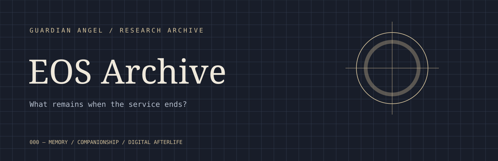

# 🗄️ EOS Archive

**Status:** Archived · **Classification:** Internal · **Service Status:** Terminated

---

## 000 Archive Notice

### 存档通知

**本文件构成《Guardian Angel》终止实时服务后的最终内部存档。**

它记录游戏的设计、服务模式、玩家与 AI 伴侣之间的关系，以及关服后留下的数字痕迹。项目旨在探讨：陪伴如何通过游戏机制与 AI 互动被建立，以及当支撑这种关系的平台消失后，角色与情感是否仍能以其他形式继续存在。

本档案结合内部记录、玩家生成内容、行业案例、媒体报道、学术研究与实践过程进行整理；在缺乏直接材料之处，将明确标注推测性分析与重构。

**This document constitutes the final internal archive of *Guardian Angel* following the termination of its live service.**

It records the game’s design, service model, the relationship between players and AI companions, and the digital traces that remain after shutdown. The project investigates how companionship is constructed through game systems and AI interaction, and whether characters and emotional relationships can continue to exist in other forms once the platform that sustains them disappears.

The archive draws on internal records, player-generated materials, industry cases, media reports, academic research and practice-based development. Where direct documentation is unavailable, speculative analysis and reconstruction are identified accordingly.

---

- [000 Archive Notice](#000-archive-notice)

- [100 Guardian Angel](#100-guardian-angel)

- [200 Companion (Why did players love him?](#200-companion-why-did-players-love-him)

- [300 Shutdown（What happened when the service ended?](#300-shutdownwhat-happened-when-the-service-ended)

- [400 Legacy（What remains?](#400-legacywhat-remains)

- [reference](#reference)

## 100 **Guardian Angel**

### 110 World

#### 111 Otome Game

Otome游戏是主要为女性开发的游戏，通常让玩家扮演与男性角色建立浪漫关系的女性主人公。“otome”不是描述一种固定的游戏风格，而是更好地理解为一种叙事类型，包括视觉小说、模拟、角色扮演和其他互动形式（Mukae，2024年）。

虽然早期的otome游戏与游戏机和基于PC的视觉小说密切相关，但该类型已经越来越多地转向移动平台。当代标题通常将浪漫叙事与现场服务系统相结合，包括日常互动、限时活动、收藏卡、消息传递和其他反复出现的角色参与形式。因此，浪漫的体验超越了完成一个固定的故事情节，并通过持续的互动而持续存在。

Otome games are games developed primarily for women, typically placing the player in the role of a female protagonist who forms romantic relationships with male characters. Rather than describing one fixed style of gameplay, “otome” is better understood as a narrative genre, encompassing visual novels, simulations, RPGs and other interactive formats (Mukae, 2024).

While early otome games were closely associated with console and PC-based visual novels, the genre has increasingly shifted towards mobile platforms. Contemporary titles often combine romance narratives with live-service systems, including daily interactions, limited-time events, collectible cards, messaging and other recurring forms of character engagement. The romantic experience therefore extends beyond completing a fixed storyline and becomes something sustained through continuous interaction.

**[30 years of otome game — No. 1: How did the term ‘otome game’ spread?](https://macc.bunka.go.jp/5021/)**

梳理“otome game”这一名称如何传播，作为本节乙女游戏类型与历史的参考。

#### 112 Game Overview

*Your personal companion.*

《守护天使》是一款以陪伴为中心的人工智能游戏。游戏没有遵循完全预定的浪漫路线，而是将脚本故事内容与自适应人工智能系统相结合，允许对话和日常互动随着时间的推移对每个玩家做出反应。它故意过时的界面让人想起前一代的浪漫游戏和个人电脑软件，而它背后的配套系统使用更先进的人工智能技术。

*Guardian Angel* is an AI otome game centred on companionship. Rather than following a fully predetermined romantic route, the game combines scripted story content with an adaptive AI system, allowing conversations and everyday interactions to respond to each player over time. Its deliberately old-fashioned interface recalls an earlier generation of romance games and personal computer software, while the companion system behind it uses significantly more advanced AI technology.

### 120 Narrative

#### 121 Story

主人公回到她长大的街区，在分开几年后意外地再次见到了她儿时的朋友。他仍然记得他们曾经去过的地方，她喜欢的事情，以及她几乎忘记的承诺，但成年后使他们的关系变得不那么轻松了。彼此亲近的生活让他们回到了彼此的日常生活。随意的用餐、散步回家、深夜谈话和小忙慢慢取代了中间几年的距离。从旧友谊的安慰开始，逐渐发展成为浪漫。

在游戏的本章中，两人已经建立了一段关系，并搬到了一起。故事已经从团聚和求爱转变为共享家庭生活，学习如何与一个几乎认识你一生的人一起生活。

The protagonist returns to the neighbourhood where she grew up and unexpectedly meets her childhood friend again after several years apart. He still remembers the places they used to visit, the things she liked and promises she has almost forgotten, but adulthood has made their relationship less effortless than it once was. Living close to one another brings them back into each other’s daily routines. Casual meals, walks home, late-night conversations and small favours slowly replace the distance of the intervening years. What begins as the comfort of an old friendship gradually develops into romance. In the current chapter of the game, the two have entered a relationship and moved in together. The story has shifted from reunion and courtship towards shared domestic life, learning how to live alongside someone who has known you for almost your entire life.

#### 122 A

作为主角的儿时好友，也是《守护天使》中的主要配角，他性格温和、值得信赖且观察入微。虽然多年未见，他比主角记忆中的那个男孩略显内敛，但他对她的熟悉依然显而易见——他能察觉细微的变化，记得她过去的习惯，并会在未经请求的情况下默默照料一切。他的性格塑造并非建立在戏剧性的表白之上，而是围绕着共同的日常习惯和实际的关怀展开：一起照料一盆植物并记得给它浇水，去超市购物，准备饭菜，或者仅仅是陪伴女主角度过日常生活中的平凡时刻。随着当前同居情节的推进，这些反复出现的小动作逐渐成为他表达爱意的主要方式。

A childhood friend of the protagonist and the primary companion character in *Guardian Angel*, he is gentle, dependable and observant. Years apart have made him slightly more reserved than the boy the protagonist remembers, although his familiarity with her remains visible in the way he notices small changes, remembers old habits and quietly takes care of things without being asked. His character is built less around dramatic declarations of affection than around shared routines and practical care: looking after a plant together and remembering to water it, going to the supermarket, preparing meals, or simply accompanying the protagonist through ordinary parts of the day. Following the current cohabitation update, these small repeated actions become the main way his affection is expressed.

### 130 Visual

ui pc98

人物 ps1 有序抖动 十字形

重点不是写游戏机历史，而是解释这些技术/时代各自产生了什么视觉特征，以及你为什么把它们重新组合成 Guardian Angel 的虚构游戏美术。比如 PC-98 → 乙游/视觉小说式界面、有限色彩和精细像素插画；PS1 → 低精度3D、抖动/像素化的数字质感；最后落到你的 **3D cel-shading + pixel treatment + PC-98-inspired UI**。

### 140 Service

内容：运营模式、每日任务、抽卡、签到、活动、约会系统

理论：Platform Studies、Live Service Games、Platform Capitalism（轻）

案例：《恋与深空》《光与夜之恋》《恋与制作人》

---

## 200 Companion (Why did players love him?

### 210 Emotional Design

内容：为什么游戏机制会培养依恋、陪伴如何被设计出来

理论：Affective Design、Affective Computing、Digital Intimacy

案例：每日登录、生日电话、陪你运动/洗澡/睡觉、短信系统、家园系统

乙女游戏中的亲密感不仅仅由叙述产生，而是通过重复的互动系统产生的。日常信息、电话、生日活动、共享活动和个性化回复让虚构角色嵌入玩家的日常生活。Ge、Hu和Ouyang（2025）通过“数字亲密素养”描述了这个过程，认为玩家学习以培养与虚拟角色在情感上有意义的关系的方式解释和参与otome游戏的文本叙事、角色设计和互动能力。从这个意义上说，陪伴不仅仅是由游戏所代表；它是通过其设计不断产生的。

Intimacy in otome games is not produced by narrative alone, but through repeated systems of interaction. Daily messages, phone calls, birthday events, shared activities and personalised responses allow fictional characters to become embedded within the player’s everyday routine. Ge, Hu and Ouyang (2025) describe this process through “digital intimacy literacies”, arguing that players learn to interpret and engage with the textual narratives, character design and interactive affordances of otome games in ways that cultivate emotionally meaningful relationships with virtual characters. In this sense, companionship is not simply represented by the game; it is continuously produced through its design.

**[Digital literacies of intimacy: women’s engagement and learning in otome video games](https://www.tandfonline.com/doi/full/10.1080/1369118X.2025.2587132#abstract)**

讨论女性玩家如何在乙女游戏中形成数字亲密关系，对应本节的互动机制与情感依恋。

### 220 AI Erotics

内容：AI恋爱、欲望投射、梦女文化

理论：AI Erotics（核心）、Parasocial Relationship、Synthetic Intimacy、Posthuman Desire

案例：Replika、Open Ai DAN、AI伴侣新闻。

### 230 Beyond Gameplay

玩家和角色之间的关系通常超出了游戏本身的界限。玩家通过粉丝小说、插图、视频编辑、在线社区和委托角色扮演来重写、保存和表演这些关系，允许角色在不同的平台和媒体形式上传播。因此，从参与文化的角度来看，玩家成为虚构世界的主动生产者，而不是被动消费者。这些做法将私人依恋转变为一种共享的文化活动，在原始游戏会话结束后很久，情感投资继续产生新的图像、叙事和解释。

The relationship between player and character often extends beyond the boundaries of the game itself. Players rewrite, preserve and perform these relationships through fan fiction, illustration, video edits, online communities and commissioned cosplay, allowing the character to circulate across different platforms and forms of media. From the perspective of participatory culture, players therefore become active producers rather than passive consumers of the fictional world. These practices transform private attachment into a shared cultural activity, where emotional investment continues to generate new images, narratives and interpretations long after the original gameplay session has ended.

**[2.5次元造梦：中国乙女游戏的破圈之路 — BBC News 中文](https://www.bbc.com/zhongwen/articles/c3ry32ypn7zo/simp)**

讨论中国乙女游戏与现实生活的联系，作为游戏之外的陪伴及玩家文化的案例。

[Confronting the Challenges of Participatory Culture — 阅读 PDF](assets/Participatory-Culture.pdf)

---

## 300 Shutdown（What happened when the service ended?

### 310 End of Service

内容：官方公告、为什么关服（角色出现了自主意识？游戏太老没人玩？）、公司调查/判断、关服流程与倒计时

案例：《Dragalia Lost》《Princess Connect! Re:Dive》《Echo of Soul》等关服公告、角色自主换衣服

### 320 Digital Death

内容：关服为什么可以被理解成一种死亡——账号、角色、玩家关系依赖服务器与平台，一旦基础设施消失，这种关系被强制终止

理论：Digital Death、Media Archaeology、Platform Ephemerality

案例：玩家告别帖、新闻报道、YouTube纪录

### 330 Presence / Absence

内容：讨论存在是否依赖服务器。如果玩家仍然记得他、录屏仍存在、Archive仍存在、AI是否仍以另一种形式存在？

理论：Presence and Absence、Guardian Angel设定、Posthumanism、Animism

案例：玩家讨论灵体

---

## 400 Legacy（What remains?

### 410 Memory Archive

内容：玩家保存录屏、Wiki、截图、数据库

理论：Archive Theory、Digital Rememberance

案例：Internet Archive、食物语陪伴服

### 420 Guardian Angel

内容：我的作品，男主仍继续生活、继续守护玩家，从被服务器承载的game character，变成存在于记忆/媒介/latent space里的守护者

理论：Angels in Latent Spaces

案例：我的视频

### 430 Digital Afterlife

内容：Archive是否意味着结束、数字生命是否还能继续存在

理论：Speculative Design、Posthuman Futures

---

## reference

**Footer：About、Company、Other Products、Legal、Contact**

